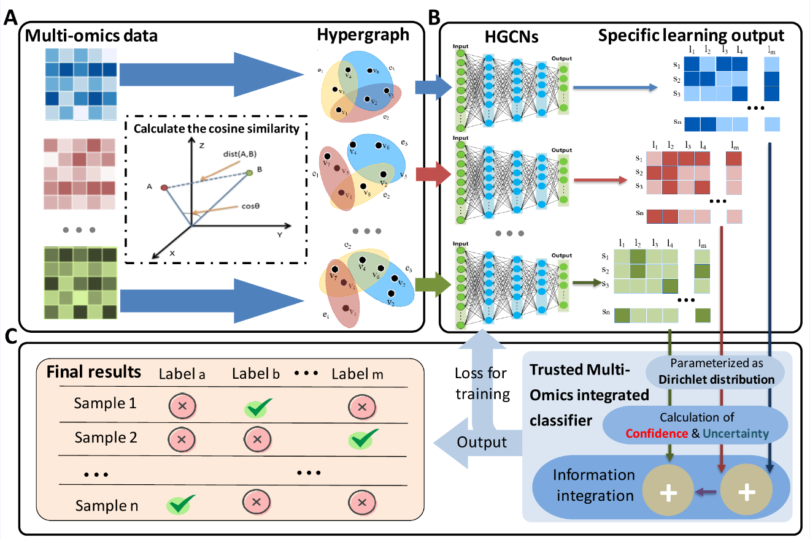

# HyperTMO: A trusted multi-omics integration framework based on Hypergraph convolutional network for patient classification

**General conceptual framework of HyperTMO.**
(A) The omics data is used to calculate the cosine similarity for each sample, and then the samples are clustered based on KNN algorithm to get the incidence matrix and form the corresponding hypergraph structure.
(B) A hypergraph convolutional neural network (HGCN) is constructed for each omics data type to perform specific learning and output as evidence for multi-omics integration.
(C)  Dirichlet distribution was parameterized based on the above evidence results, and then the confidence and uncertainty parameters were calculated for each omics data type. Finally, cross-omics information integration was performed based on the D-S evidence theory, and output the classification results with trusted multi-omics integration.

## Dependencies
- Compatible with PyTorch 1.8.0 and Python 3.x.
- For data (and/or splits) not used in the paper, please consider tuning hyperparameters such as hidden size, learning rate, seed, etc. on validation data.
## Run
    python train.py -fd BRCA -nc 5
- `-fd` The dataset file folder.
- `-nc` Number of classes.
- `-kn` Number of vertices in hyperedge.
## Citation
- This article has been accepted by bioinformatics
